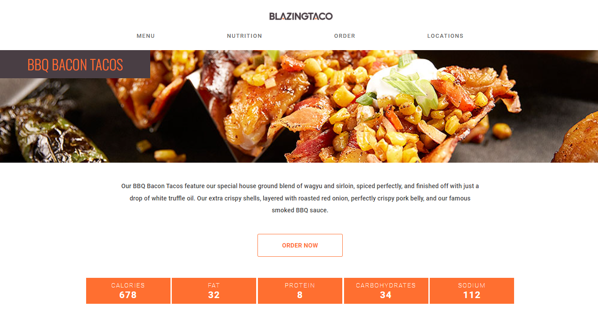

# 🌮 Taco Delivery Website
Um projeto pessoal com foco em HTML e CSS.
Página estática de site para uma empresa fictícia de delivery de tacosm BlazingTaco 🔥

## Tecnologias Utilizadas:
- HTML
- CSS

## Motivação
- Exerício baseado em página de delivery de hambúrguer, do curso de Front-End Engineer da CodeCademy.

